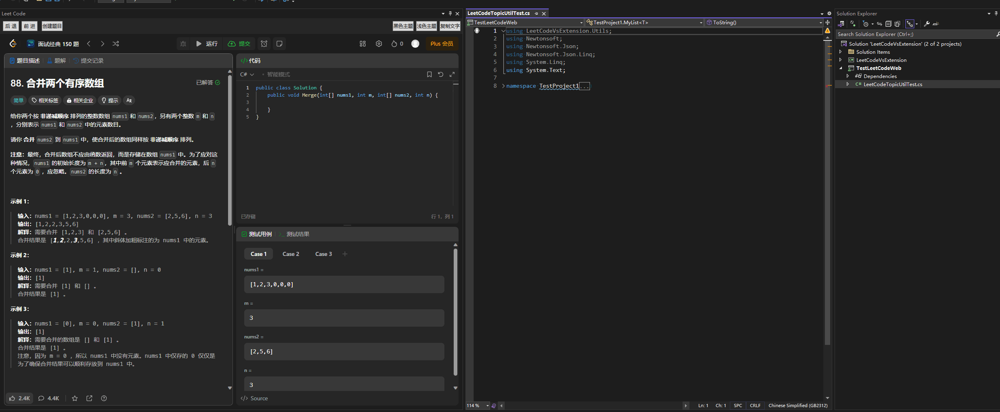

# VisualStudioExtensions
VS扩展. 目前已经将Leetcode通过WebViewe2整合进了插件中

## LeetCodeVsExtension 

使用WebView2, 将LeetCode的界面内置到 Visual Studio 中, 实现更加方便刷取每日一题的内容

### 计划列表 

- [ ] 快捷打开每日一题
- [ ] 在VS中写好代码, 选中指定代码, 右键/快捷键自动上传提交

#### 已经完成 
- [x] 内嵌LeetCode网站
- [X] 禁止页面弹出新的标签页
- [X] 适配LeetCode VS 深色/浅色背景切换(模拟鼠标点击, 不保证时刻有效)
- [X] 清理浏览器相关Cooking
- [X] 复制用例数据 生成对应的C#数组结构
- [X] 在VS中创建每日一题的模板, 将题目中代码部分创建到新的文件夹和对应的CS文件  

## How To Using?

安装该插件后, 会出现一个新的窗口.通过 View -> Other Windwos -> Leet Code 打开.  
第一次使用需要自己登录一下, 相关Cooking会储存在本地.  

### 创建题目

目前只适配了CShapre的创建类型. 其他的有需求再说.  

执行要求: 
- 需要打开题目
- 需要打开解决方案, 并且解决方案中有项目处于选中状态

## 其他说明  

### WebView2缓冲文件夹可能需要手动删除

因为是内嵌的WebView2的, 运行WebViewe2需要设置缓冲文件夹. 因为不知道如何在卸载插件的时候执行删除缓冲的操作, 如有谁知道可以告诉我一下.  
目前默认的缓冲文件夹路径:  
Environment.SpecialFolder.LocalApplicationData + VsExtension  
C:\Users\{user name}\AppData\Local\VsExtension
